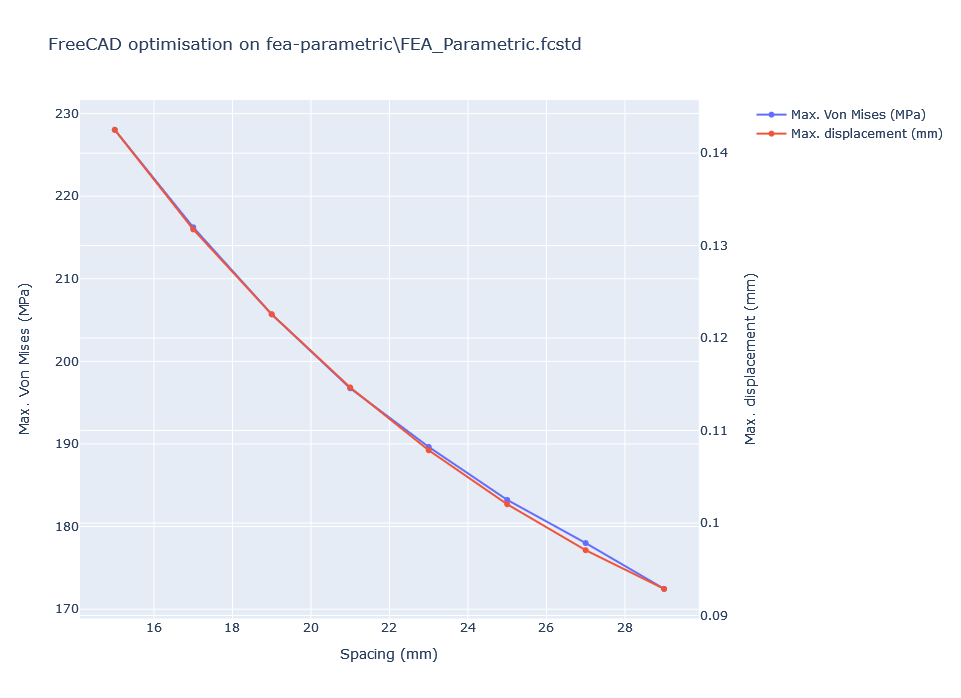

# Parametric FEA in Freecad

In this tutorial we'll look at setting up a structural FEA analysis of a simple component, in a way that allows us to simply automate a parametric analysis by running FreeCAD headless, and using only tools available within FreeCAD.

We will cover:
 * [setting up the CAD model](#cad-model-set-up) (avoiding the topological naming issue)
   * [scripting the parameter change](#script-the-parameter-change-in-the-cad-model)
   * [simplifying the CAD model for the FEA analysis](#simplify-the-cad-model-for-the-fea-analysis)
 * [setting up the FEA analysis](#setting-up-the-fea-analysis)
 * [scripting the FEA](#scripting-the-fea)
 * [running it all and analysing the results](#running-the-lot)

## CAD model set up
The objective is to determine how thin we can make the component's neck without exceeding a certain Von Mises stress or a certain maximum component elongation. The load will be radial through one of the holes. Here's a sketch of the finished component with two different gap sizes; worth mentioning that I am using PartDesigner for this.


We're going to create a pad without the cutout first, using the following dimensions (feel free to change them though!):


As I want to drive the cutout via the gap size, I'm using a set of two parallel construction lines tangent to the cutout circles. In this sketch, the cutout line is set to 15mm and I have renamed it to `Spacing` (double click on the dimension to rename it inside Sketcher).


At this point I have also added a fillet between the cutout and the rest of the body. This is what my part tree looks like:


I have taken care of renaming the sketches so they make a bit more sense and this will be useful to keep your code tidy later. Note how the named constraint inside PocketSketch is visible as `Spacing` under the `Constraints` list. 

### Script the parameter change in the CAD model
You can manually change the value of `Spacing` to see if your model breaks (spoiler: if you have added a fillet it eventually will, when the value is too small).

You can also try your hand at Python using the FreeCAD shell. Try and paste this code inside the Python Console:

```python
# select the sketch (the shape is called "Pocket")
target_sketch = App.activeDocument().getObject("Pocket").Profile[0]

# loop over constraints to find the named one
for (edge_idx, constraint) in enumerate(target_sketch.Constraints):
	if constraint.Name == "Spacing":
		break

# set the datum to the desired value
target_sketch.setDatum(edge_idx,25)

# apply changes and recompute
App.activeDocument().recompute()
```

This should set the `Spacing` constraint inside the `Pocket` feature to `25mm`

### Simplify the CAD model for the FEA analysis
As tempting as it sounds, don't be tempted on running a FEA on the component as it is. If you're running lots of analyses it's a good idea to see if you can get away with some simmetry simplification. I like to do it after building the full model by using cutting planes, so that I still have the original model for design intent, manufacturing... etc. 

> :warning: **this only works if the loads are symmetric as well as the geometry!** If your loads and boundary conditions are not mirrored then you can't simplify the geometry.

In this case we can get away with cutting the model to 1/8 of its size. An even better way would be to run this as a 2-D analysis, but we'll stick with 3D for now.


## Setting up the FEA analysis
From the FEM workbench, you need to set up:
* an Analysis container
* a material (for solid in this case)
* a mesh (I'm using Netgen)
* a solver (Calculix in this example)
* boundary conditions (the 3x X/Y/Z symmetries, as we just cut up the model)
* forces (a 5kN force in the X direction)
* a results object (`CCX_Results`)
* (optional) a results pipeline

This is what the model looks like (I am showing the original body as well):


And this is the model tree:


You can run the FEA and look at the results by setting up a ResultPipeline object. Here's the Von Mises stress superimposed to the deformed shape:


## Scripting the FEA

To run the FEA programmatically, try running the following:

```python
from femtools import ccxtools
fea = ccxtools.FemToolsCcx()
fea.check_prerequisites()
fea.purge_results()
fea.reset_all()
fea.update_objects()
fea.run()

fea_results_obj = doc.getObject("CCX_Results")
print(max(fea_results_obj.vonMises))
```

You should get the maximum Von Mises stress in MPa in the console.

## Running the lot

`fea-parametric.py` has a few support functions and lets you specify the model parameters in the `settings` section:

```python
# settings
filename = "fea-parametric\\FEA_Parametric.fcstd"
object_name = "Pocket"
constraint_name = "Spacing"
constraint_units = "mm"
fea_results_name = "CCX_Results"
solver_name = "SolverCcxTools"

# range of the parameter values to sweep (passed directly to np.arange)
(param_min, param_max, param_step) = (15, 30, 2)
```

In this case we're setting up the analysis to run on the `Spacing` constraint driving the sketch inside the `Pocket` feature. We're running the analysis by changing the value of the dimension between 15mm and 30mm in steps of 2mm.

The result should look like this (using plotly as a backend):

