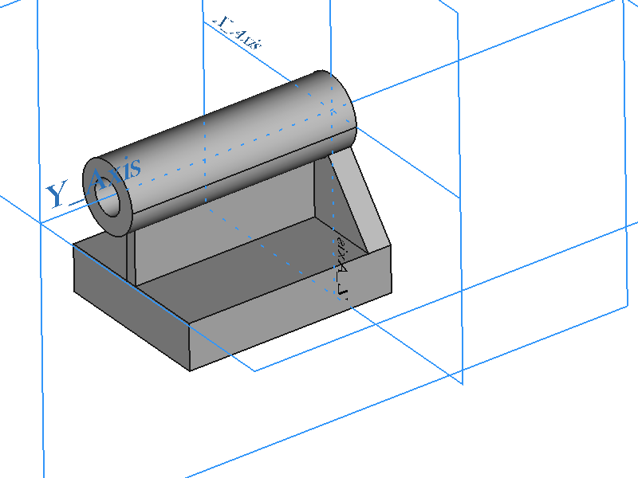
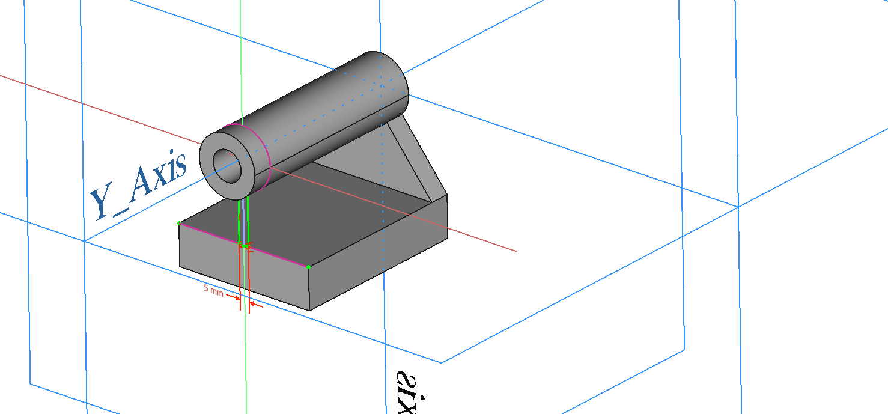
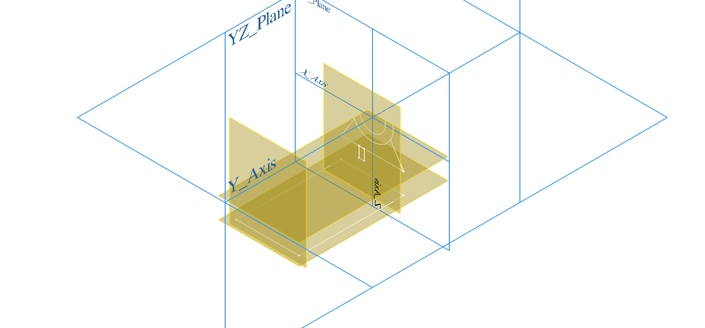
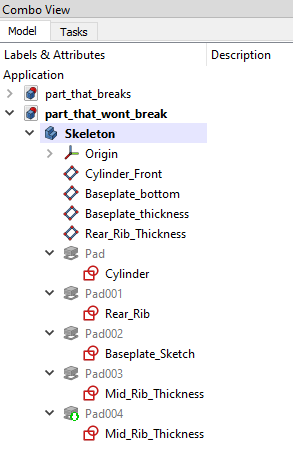

# Making unbreakable FreeCAD parts

In this tutorial we'll look at a few ideas on how to generate robust parts in FreeCAD, so that they don't break by means of the [Topological Naming Problem](https://wiki.freecadweb.org/Topological_naming_problem).

# The part

This is the part. In my model it's around 100mm x 60mm, and roughly 80mm tall. Of course you can model this with the size you want. I will not judge.

# A part that will break

A model that most definitely breaks if you try and change something, is shown here:
[part_that_breaks.FCStd]([part_that_breaks.FCStd])

All features are comically derived from the previous one in awkward ways to make a point. I have even started the central rib off the far face of the bottom plate.:

This is awful. Don't do this. Not just in FreeCAD, it's terrible practice in general.

# A part that will be hard to break

Before modeling any solids, I created a bunch of sketches and datum planes. I want to use datum planes to define, as it goes, *datums*. I thought a good set would be the one shown below:

This contains:
 * the profile of the cylinder `Cylinder_Front`
 * the profile of the rear triangular rib `Rear_Rib`
 * the distance between the cylinder axis and the bottom of the baseplate `Baseplate_bottom`
 * the footprint of the baseplate `Baseplate_Sketch`
 * the thickness of the bottom of the baseplate `Baseplate_thickness`, defined as a plane offset from `Baseplate_bottom`
 * an offset plane defining the `Rear_Rib_Thickness`

This allows the model to not break. Try for yourself! In the video, I added a cutout to the rear rib to both models, showing how that change will not break everything if you use this strategy.

Once the datum features and sketches are in place, you can reuse them as many time as you want. In the tree below you can see how I used `Mid_Rib_Thickness` twice in the last two pads. Changing one changes also the other, and vice versa - it's two references to the same sketch.

